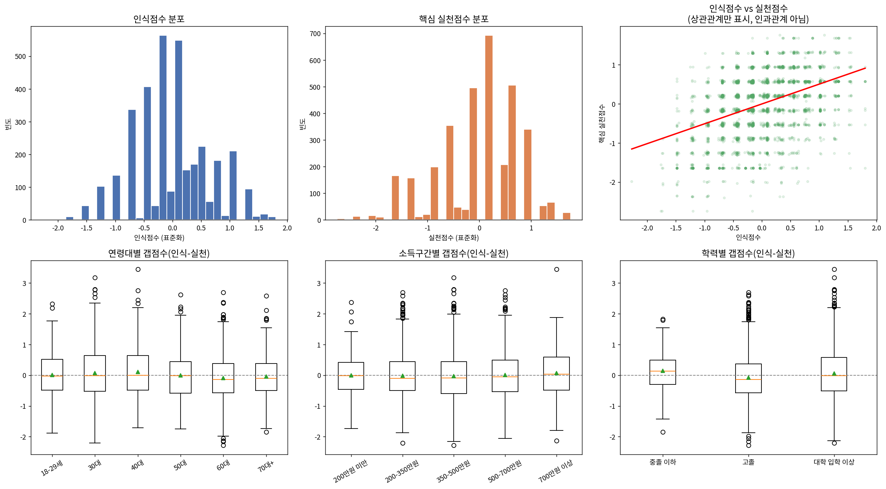

# [연구 분석 보고서] 서울시민의 영양성분 "인식-실천" 갭(Gap) 분석
## - 2024년 서울시민 먹거리조사 원시자료를 바탕으로 -

**분석 대상**: 2024 서울시민 먹거리조사 참여 만 18세 이상 가구원 3,435명  
**연구 방법**: 지표 표준화 평균 산출, 상관분석, 비모수 평균 차이 검정(Kruskal-Wallis, Mann-Whitney), 다중회귀분석(OLS), 변수별 상대적 설명력 분석(Type-II ANOVA)

---

## 1. 서론 (Introduction)

### 1-1. 연구 배경 및 목적
현대 보건학 및 영양학에서 영양성분 표시(나트륨, 첨가당 권고량 등)에 대한 올바른 지식과 이해는 건강한 식생활 실천을 위한 핵심적인 선행 조건으로 간주된다. 그러나 영양 정보를 '알고 있는 수준(인식)'과 이를 실제 구매 및 식생활에서 '확인하고 고려하는 수준(실천)' 사이에는 괴리가 존재할 수 있으며, 이를 **'지식-행동 격차(Knowledge-Action Gap)'** 또는 **'인식-실천 갭(Gap)'**이라 칭한다. 
본 연구는 2024년 서울시민 먹거리조사 데이터를 활용하여 서울시민의 영양성분에 대한 인식과 실천 수준을 정량화하고, 두 지표 간의 상관관계 및 인구통계학적 특성별 갭의 격차를 실증적으로 규명하여 향후 보건 영양 정책 수립의 기초 자료를 제공하고자 한다.

### 1-2. 연구 설계의 전제 조건 및 제한점
1. **단면연구(Cross-sectional Study)의 한계**: 본 연구에 사용된 데이터는 동일 시점에 수집된 단면조사 자료이다. 따라서 영양성분 인식과 실천 간의 통계적 유의성을 검증하더라도 이는 '상관관계' 또는 '연관성'을 의미할 뿐이며, 시간적 선후관계에 기반한 **'인과관계(인식이 실천을 유발함)'를 증명하는 것은 불가능**하다. 결과 해석 및 논의 시 모든 서술은 연관성 또는 차이 검정의 언어로 제한한다.
2. **자기보고식(Self-report) 설문의 편향**: 설문 응답은 응답자의 기억과 주관적 판단에 의존하는 자기보고 방식으로 수집되었다. 특히 실천 문항의 경우, 도덕적으로 바람직한 행동을 과장하여 보고하려는 **'사회적 바람직성 편향(Social Desirability Bias)'**이 개입되었을 가능성이 농후하다. 반면, 지식 문항(나트륨·첨가당 권고량)은 객관식 정답 여부로 평가되므로 상대적으로 편향의 여지가 적다. 이러한 비대칭적 편향으로 인해 실제보다 실천 점수가 과대추정되어 평균 갭이 상쇄되었을 가능성을 인지하고 결과를 해석해야 한다.

---

## 2. 데이터 준비 및 전처리 (Data Pre-processing)

본 분석은 원시자료의 구조적 특징과 설문 설계상의 분기를 고려하여 정밀한 전처리 과정을 적용했다.

### 2-1. 이상치 및 결측치 처리 기준
1. **시스템 결측 검증**: 코드북에 정의된 범위를 벗어난 이상치(오류 코드 등)를 검사하였으나, 분석 대상 변수 전수에서 오류값은 발견되지 않았다.
2. **구조적 결측(Structural Missingness) 해소**:
   - **영양표시 확인 문항의 연령 분기 병합**: 65세 미만을 대상으로 한 외식가공식품 영양표시 확인 여부(B14, 원본 결측 733건, 21.34%)와 65세 이상을 대상으로 한 가공식품 소비기한 및 영양표시 확인 여부(B15, 원본 결측 2,702건, 78.66%)는 조사 설계상의 분기로 인한 상호배타적 결측이다. 이를 연령 기준(만 65세)으로 병합하여 단일 파생변수인 `영양표시확인여부`를 생성함으로써 결측을 100% 해소했다. (단, B14는 영양표시만, B15는 소비기한을 함께 묻는 비동등 문항이므로 해석 시 각주 명시 필요)
   - **고용형태 변수(DM07)의 구조적 결측 처리**: 비경제활동인구(학생, 주부, 무직 등 976건, 28.4%)의 고용형태 결측은 단순 결측(Missing at Random)이 아닌 구조적 생략이다. 이를 회귀분석 시 리스트와이즈 제거(Listwise Deletion)할 경우 표본 편향이 발생하므로, '비경제활동(코드 99)'이라는 별도 범주로 결측을 대체하여 분석에 포함했다.
3. **제도적 결측(Institutional Missingness) 처리**:
   - 식품영양정보고려정도(C3_6), 건강식품구매정도(C3_5), 신선식품우선구매정도(C3_7) 문항에서 나타난 **"⑨ 구매경험없음" 응답(각 43건, 1.25%)**은 실천 수준이 낮음(0점)으로 대체될 수 없다. 이는 소비 기회 자체가 없었던 집단이므로 통계 왜곡을 막기 위해 결측(NaN)으로 처리하고 지표 계산(평균)에서 제외하였다.
4. **지식 문항의 이진화(Binarization)**:
   - WHO 나트륨 1일 권고량(B11)과 첨가당 1일 권고량(B12) 문항은 정답(2번 코드: 2,000mg 및 50g)인 경우만 1점, 오답 및 "잘 모른다(4번 코드)" 응답은 0점으로 처리하여 이진 파생변수로 변환했다. "잘 모른다"는 결측이 아닌 오답(지식 없음)의 유효 범주로 취급했다.

---

## 3. 지표 구성 및 신뢰도 검증 (Index Construction & Reliability)

### 3-1. 지표 산출 방식
서로 다른 척도(이진형 및 5점 리커트 척도)의 문항들을 결합하기 위해 개별 문항을 표준화(z-score)한 후 평균을 계산하는 방식을 취했다. 신뢰도 보장을 위해 각 지표 구성 문항 중 60% 이상 정상 응답한 케이스에 한해서만 지표 점수를 산출했다.

- **인식 점수(Awareness Score)**: 5개 문항 표준화 평균
  - 나트륨 지식 정답 여부 (B11)
  - 첨가당 지식 정답 여부 (B12)
  - 영양균형식품 인지도 (B17_1)
  - 가공식품 정보 이해도 (B18_1)
  - 건강광고 판단 정도 (B18_5, 보조)
- **핵심 실천 점수(Core Practice Score)**: 3개 문항 표준화 평균
  - 영양표시확인여부 (B14/B15 병합)
  - 가공식품 정보 확인 정도 (B19_2)
  - 식품영양정보 고려 정도 (C3_6)
- **보조 실천 점수(Supplementary Practice Score)**: 3개 문항 표준화 평균
  - 건강식품 구매 정도 (C3_5)
  - 신선식품 우선 구매 정도 (C3_7)
  - 식생활 노력 정도 (B4)
- **갭 점수(Gap Score)**: $Gap = 인식 점수(z) - 핵심 실천 점수(z)$

### 3-2. 신뢰도 분석 (Cronbach's $\alpha$)
문항 간 내적 일관성을 검정한 결과는 다음과 같다.
- **인식 지표**: $\alpha = 0.652$ (수용 가능)
- **핵심 실천 지표**: $\alpha = 0.667$ (수용 가능)
- **보조 실천 지표**: $\alpha = 0.540$ (신뢰도 다소 낮음, 해석 시 주의 필요)
핵심 분석 지표(인식 및 핵심 실천)는 사회과학 분야에서 통상적으로 인정되는 신뢰도 기준치($\alpha \geq 0.6$)를 상회하여 합산 지표 구성의 타당성을 확보했다.

---

## 4. 가설 검정 및 분석 결과 (Hypothesis Testing)

### H1. 인식 수준과 실천 수준은 양(+)의 상관관계를 가질 것이다 (채택)
- **분석 결과**: Spearman $\rho = 0.398$ ($p < 0.001$, $n = 3,435$), Pearson $r = 0.416$ ($p < 0.001$)
- **해석**: 통계적으로 매우 유의한 양의 상관관계가 검증되었다. 그러나 상관계수 값은 약 0.4 수준으로 **'중간 정도의 연관성'**에 해당한다. 이는 인식이 높아지면 실천도가 상승하는 경향이 뚜렷하지만, 개별 산포가 크기 때문에 '지식이 풍부함에도 실천하지 않는 집단'과 '지식 수준은 낮으나 실천을 잘하는 집단'이 혼재되어 있음을 의미한다.

### H2. 인식-실천 갭(격차)이 존재할 것이다 (부분 채택)
- **분석 결과**: 평균 갭 점수 = $0.003$ ($95\% \text{ CI}: -0.023 \sim 0.029$, $n = 3,435$)
- **집단 구분**: 실천 > 인식 ($42.8\%$), 인식 > 실천 ($37.3\%$), 일치 ($19.9\%$)
- **해석**: 서울시민 전체 평균 차원에서의 갭 점수 신뢰구간은 0을 포함하므로, **체계적으로 어느 한 방향으로 쏠린 거시적 갭은 존재하지 않는다**고 결론지을 수 있다. 그러나 개인 수준에서는 응답자의 80.1%가 격차를 보이고 있어 **'개인별 격차의 변동성이 매우 크다'**는 가설은 지지된다. 즉, "시민 전반이 지식만 있고 실천을 안 한다"와 같은 일방적 해석은 사실과 부합하지 않는다.

### H3. 인식-실천 갭의 크기는 연령대에 따라 차이가 있을 것이다 (채택)
- **분석 결과**: Kruskal-Wallis $H = 22.636$, $p < 0.001$ (연령대 6개 집단 비교)
- **해석**: 연령대에 따른 갭 점수의 평균 차이는 매우 유의하다.
  - **30대(갭: 0.071)**와 **40대(갭: 0.108)**: 갭이 양수로 나타나 인식 수준에 비해 실제 실천 활동이 미치지 못하는 **'인식 우위(실천 부족)'** 성향을 보인다.
  - **60대(갭: -0.094)**: 갭이 음수로 나타나 인지적 수준에 비해 생활 속 실천율이 상대적으로 높은 **'실천 우위'** 패턴을 보인다.

### H4. 인식-실천 갭의 크기는 소득 및 학력 수준에 따라 차이가 있을 것이다 (학력 채택, 소득 유보)
- **분석 결과**: 학력 $H = 31.032$, $p < 0.001$ (유의함) / 소득구간 $H = 9.634$, $p = 0.047$ (경계적 유의)
- **해석**: 학력에 따른 격차는 매우 뚜렷하다.
  - **중졸 이하 집단(갭: 0.143)**은 인식 점수와 실천 점수 모두 전체 집단 중 가장 낮음과 동시에, 인식 대비 실천의 낙차가 가장 커 **취약 집단**으로 분류된다.
  - **고졸 집단(갭: -0.081)**은 실천 우위 경향을 보이며, **대졸 이상(갭: 0.055)**은 다시 인식 우위 경향을 띤다.
  - 소득구간별 갭 차이는 $p=0.047$로 유의수준 5% 경계선에 걸쳐 있어 해석에 주의가 필요하다. 또한 학력과 소득은 서로 유의한 상관관계(Spearman $\rho = 0.378$, $p < 0.001$)를 가지므로, 소득 단독의 효과라기보다는 두 사회경제적 지표의 복합적 영향으로 보아야 한다.

### H5. 식품 구매 및 식사 준비 주체 여부에 따라 실천 수준이 다를 것이다 (채택)
- **분석 결과**: 식품구매주체(DQ1) 검정 $p < 0.001$ / 식사준비주체(DQ2) 검정 $p < 0.001$ (Mann-Whitney U)
- **해석**: 직접 가구 내 식품을 구매하는 주체(실천 평균: 0.069)와 조리를 담당하는 주체(실천 평균: 0.083)가 비주체 집단(각 -0.109, -0.124)에 비해 실천 수준이 통계적으로 유의하게 높다. 이는 실천 문항의 맥락이 실제 마트 구매나 부엌 조리 상황을 전제하므로, **행동의 기회적 요인(Opportunity)**이 실천을 규정하는 핵심 변수임을 방증한다.

### H6. 다른 통제변수를 고려해도 인식-실천 연관성은 유지될 것이다 (채택)
성별, 연령대, 학력, 소득, 직업, 고용형태를 모두 통제한 OLS 다중회귀모형을 구축하였다. (설명력 $R^2 = 21.5\%$)
- **분석 결과**: 인식 점수 표준화회귀계수 **$\beta = 0.460$ ($p < 0.001$, $t = 23.577$)**
- **해석**: 다차원적 통제 하에서도 인식 점수는 실천을 설명하는 가장 강력한 변수로 남는다. 기준에 따라 $\beta = 0.460$은 **'중간에서 다소 강함'** 수준의 연관성을 의미한다.
- **주요 통제변수 효과**:
  - **성별**: 여성($\beta = 0.240$, $p < 0.001$)이 남성 대비 유의하게 높은 실천도를 보인다.
  - **학력**: 중졸 이하 대비 고졸($\beta = 0.392$, $p < 0.001$) 및 대졸 이상($\beta = 0.391$, $p < 0.001$)의 실천 기여도가 뚜렷하다.
  - **연령대**: 다중회귀모형 내에서는 연령대의 단독 효과가 유의하지 않았다($p > 0.05$). 이는 H3에서 관찰된 연령대별 차이가 단독 효과라기보다 연령과 공선성을 갖는 소득, 학력, 구매 주체 여부 등 제3의 변수들에 의해 매개되거나 흡수되었음을 시사한다.

#### 변수별 상대적 설명력 분석 (Type-II ANOVA 제곱합 분할)
회귀모형 내 변수들의 상대적 기여율을 분석한 결과는 다음과 같다.

| 변수 | 설명비율(Variance Explained) | p-value |
|---|---|---|
| **인식 점수 (Awareness Score)** | **13.49%** | **< 0.001** |
| 성별 (Gender) | 1.70% | < 0.001 |
| 학력 (Education) | 0.76% | < 0.001 |
| 고용형태 (Employment) | 0.51% | < 0.001 |
| 직업 (Job) | 0.35% | 0.014 |
| 소득 (Income) | 0.22% | 0.059 |
| 연령대 (Age Group) | 0.14% | 0.321 (비유의) |
| **잔차 (Unexplained Variance)** | **82.83%** | - |

인식 점수의 기여도(13.49%)는 통제변수 중 가장 영향력이 큰 성별(1.70%)의 약 8배에 달할 정도로 독보적이다. 그러나 모형 전체가 설명하지 못하는 영역이 82.83%에 달해, 실제 영양성분 표시 실천 여부는 지식이나 인구통계 변수 외에 **시장 환경, 식품 가격, 접근성, 개인의 고착화된 구매 습관** 등 외부적 요인에 의해 더 크게 좌우됨을 추론할 수 있다.

---

## 5. 분석 신뢰성 및 강건성 검증 (Robustness Checks)

본 연구에서 도출된 통계적 해석의 타당성을 확보하기 위해 세 가지 민감도 분석을 실시했다.
1. **가중치(Sampling Weights) 적용 전후 비교**:
   - 가중치 적용 시 기술통계 지표가 전반적으로 우하향하였다 (인식 평균: 0.000 $\rightarrow$ -0.048, 실천 평균: -0.003 $\rightarrow$ -0.117). 이는 설문에 참여 완료된 표본이 실제 서울시 모집단에 비해 영양성분에 대한 인식 및 실천 성향이 다소 과대대표(치우침)되어 있음을 보여준다. 따라서 절대적 기준을 공표할 때는 반드시 가중치를 반영한 수치를 사용해야 한다.
2. **지표 구성 민감도 검증**:
   - 핵심 실천점수 대신 보조 실천문항을 포함한 '전체 실천점수'를 사용하여 인식 점수와의 상관을 재검정했을 때도 상관계수의 크기와 유의성에 유의미한 차이가 없었다 (Core: $\rho=0.398$ vs Full: $\rho=0.384$).
3. **기존 공인지수와의 준거 타당도 검증**:
   - 새로 구성한 핵심 실천점수가 기존 영양지수(NQ)의 실천등급코드(`전체실천상중하코드`)와 통계적으로 유의한 정(+)의 상관관계($\rho = 0.391$, $p < 0.001$)를 나타냄으로써 구성 개념의 준거 타당성(Criterion Validity)을 간접 검증했다.

---

## 6. 결론 및 정책적 제언 (Conclusions & Discussion)

1. **지식의 정밀화보다 행동의 가이드라인 제공 필요**: WHO 나트륨 및 첨가당의 구체적인 1일 권고 수치 정답률은 25% 내외(무작위 무응답 수준)로 극히 저조하였으나, 영양성분 확인 정도 등의 태도성 실천 점수는 비교적 양호했다. 이는 개별 영양성분의 정확한 '수치적 지식'을 교육하는 것보다, 식품 뒷면의 영양표시를 '쉽게 읽고 선택하는 행동 절차'를 교육하는 것이 실천 제고에 더 효과적일 수 있음을 시사한다.
2. **취약 집단 중심의 핀포인트 개입**: 저학력층(중졸 이하) 및 가구 내 식품 구매/조리에 관여하지 않는 집단은 인식과 실천 모든 지표에서 가장 취약하며 갭 또한 가장 크게 벌어졌다. 이들 집단을 타겟으로 한 접근성 높은 영양 정보 전달 체계 구축이 시급하다.
3. **가구 내 관여 촉진 방안**: 식품 구매 및 식사 준비 여부가 실천 점수를 직접 규정하므로, 1인 가구 증가세와 맞물려 시민 개개인이 자신의 식생활에 주체적으로 관여할 수 있도록 돕는 실천적 캠페인 프로그램이 요구된다.
4. **환경적 요인 규명의 필요성**: 다중회귀모형의 미설명 분산이 82.83%에 달하므로, 지식 전달 위주의 보건 교육만으로는 한계가 명확이다. 저염·저당 식품의 유통 다변화, 가격 인센티브 등 소비 환경적 인프라 개선 연구가 병행되어야 한다.

---

## 7. 시각화 종합 (Visualizations Overview)

아래 그림은 분석 과정에서 도출된 인식/핵심실천 점수의 기술적 기술통계 분포, 변수 간의 분산 관계(산점도 및 적합 회귀선), 그리고 주요 인구통계학적 특성(연령대, 소득구간, 학력)에 따른 갭 점수의 분포적 차이를 종합적으로 시각화한 요약본이다.

